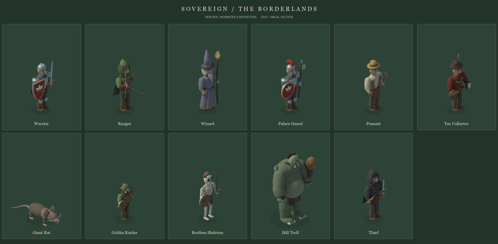

# Sovereign characters

Eleven original Blender miniatures match the buildings' isometric camera, warm
daylight, muted materials, crimson heraldry, aged metal, leather, and ivory.

| Heroes | Crown staff | Monsters |
|---|---|---|
| Warrior, Ranger, Wizard, Thief | Palace Guard, Peasant, Tax Collector | Giant Rat, Goblin Raider, Restless Skeleton, Hill Troll |



[Animated preview](units-animated.gif) · [In-game view](units-in-game.png) ·
[All individual poses](../../../test/spritesheet.html?only=units)

Each character has one idle pose, four walking poses, and three action poses.
Combat uses windup, strike/cast, and recovery frames over the existing 0.34-second
attack timer. Peasants use the hammer action while building or repairing; collectors
carry their ledger and purse. Characters face right in the source renders and
mirror horizontally when facing left, as in the original game.

## Re-render

From the project root, using Blender and the project's Pillow environment:

```sh
blender --background --factory-startup --python-exit-code 1 --python tools/art/render_units.py -- --resolution 960 --samples 48
.venv/bin/python tools/art/finish_units.py
```

For one character, add `--only warrior` to the render command. The exporter reads
all eleven characters. For faster drafts, use `--resolution 384 --samples 16 --poses idle
--output /tmp/sovereign-units-draft`; drafts are not suitable for the runtime exporter.

`source/<type>.blend` contains editable geometry, materials, camera and lighting,
with eight pose collections and a timeline that displays one pose per frame.
`source/<type>-<pose>.png` are the transparent 960×960 master renders.
The camera uses a 30° elevation and a fixed orthographic scale. The troll's camera
is raised to contain its overhead attack without reducing its size.

## Runtime exports

`<type>.png` is a four-column, two-row atlas. Pose order is idle, walks 0–3, then
actions 0–2. The exporter crops a shared transparent margin around all eight poses,
adds a soft contact shadow, and retains every source pixel: ten texture pixels per
logical game pixel. It checks for clipped silhouettes before exporting.

`units-sprites.js` provides frame rectangles, common foot anchors, visible bounds,
selection centers/radii, and stable health-bar positions. `units.json` also records
the source scenes and crop coordinates. PNG and script URLs include content hashes
so a reload picks up edited artwork.

The game keeps one atlas canvas per character, samples individual frames when
drawing, and uses smooth scaling. It waits for textures before starting. If a
character atlas is unavailable, that character retains all its procedural poses.
Selection, recruitment cards and inspector portraits use the same imported art.

Source scenes, master renders, metadata and previews are authoring files; the
hosting build includes only the eleven atlases and their JavaScript manifest.
